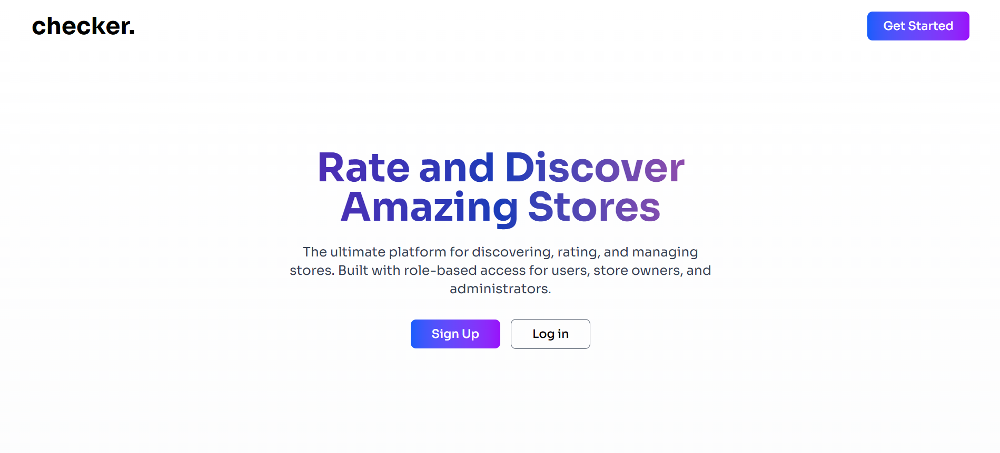

# checker. - AFullStack Store Rating Application

A web application that allows users to submit ratings for stores registered on the platform. The application features role-based authentication with different functionalities for System Administrators, Normal Users, and Store Owners.

## Tech Stack

### Backend

- **Framework**: ExpressJS
- **Database**: MySQL

### Frontend

- **Framework**: ReactJS

## Project Overview

This application provides a comprehensive store rating system where users can rate stores on a scale of 1-5. The system implements role-based access control with three distinct user types, each having specific permissions and functionalities.


_Demo Video_

<hr/>



_Modern landing page with hero section, feature highlights, and call-to-action_

<hr/>


_User Store List_


_User Store List Post Rating_


_User Profile_


_User Rating Modal_

<hr/>


_Admin Dashboard_


_Admin User Management Panel_


_Admin Store Management_


_Admin Create New Store Modal_

<hr/>


_Store Owner Dashboard_


_Store Owner Profile_

## User Roles

### 1. System Administrator

- Manage users and stores
- Access comprehensive dashboard with analytics
- Full administrative control over the platform

### 2. Normal User

- Register and authenticate on the platform
- Browse and search stores
- Submit and modify ratings for stores
- Manage personal account settings

### 3. Store Owner

- Access store-specific dashboard
- View customer ratings and feedback
- Monitor store performance metrics

## Features

### System Administrator Features

- **User Management**: Add new stores, normal users, and admin users
- **Dashboard Analytics**:
  - Total number of users
  - Total number of stores
  - Total number of submitted ratings
- **User Creation**: Add users with Name, Email, Password, and Address
- **Store Management**: View all stores with Name, Email, Address, and Rating
- **User Listings**: View all users with Name, Email, Address, and Role
- **Advanced Filtering**: Filter listings by Name, Email, Address, and Role
- **Detailed User Views**: Access complete user profiles including ratings for Store Owners

### Normal User Features

- **Account Management**: Sign up and log in functionality
- **Profile Updates**: Change password after authentication
- **Store Discovery**: Browse all registered stores
- **Search Functionality**: Find stores by Name and Address
- **Rating System**: Submit and modify ratings (1-5 scale) for stores
- **Store Information**: View store details including:
  - Store Name
  - Address
  - Overall Rating
  - Personal submitted rating
  - Rating submission/modification options

### Store Owner Features

- **Authentication**: Secure login access
- **Password Management**: Update account password
- **Performance Dashboard**:
  - View list of users who rated the store
  - Monitor average store rating
- **Customer Insights**: Access to customer feedback and ratings

## Form Validations

### User Input Requirements

- **Name**: 20-60 characters
- **Address**: Maximum 400 characters
- **Password**: 8-16 characters with at least one uppercase letter and one special character
- **Email**: Standard email format validation

## Technical Requirements

### Database Design

- Follow database design best practices
- Implement proper relationships between entities
- Ensure data integrity and normalization

### Frontend Requirements

- Responsive design using ReactJS
- User-friendly interface for all user roles
- Client-side form validation
- Sorting functionality for all data tables (ascending/descending)

### Backend Requirements

- RESTful API design
- Secure authentication and authorization
- Server-side validation
- Proper error handling
- Role-based access control

## Data Management Features

### Sorting Capabilities

All data tables support sorting functionality for key fields including:

- Name
- Email
- Address
- Role
- Rating

### Search and Filter Options

- Store search by name and address
- User and store filtering by multiple criteria
- Real-time search functionality

## Security Features

- Secure user authentication
- Role-based authorization
- Password encryption
- Input validation and sanitization
- Protected routes based on user roles

## .env Essentials

Create a `.env` file in your project root directory with the following environment variables:

```bash
PORT=3001
REACT_APP_API_URL="http://localhost:3001/api"
CLIENT_URL="http://localhost:3000"

DB_HOST="localhost"
DB_PORT=5432
DB_USER="your_database_username"
DB_PASSWORD="your_database_password"
DB_NAME="your_database_name"

JWT_SECRET="your_super_secret_jwt_key_here"
```

### Setup Instructions

1. Copy the template above into a new `.env` file
2. Replace placeholder values with your actual configuration
3. Ensure your `.gitignore` includes `.env`
4. Restart your development server after making changes
